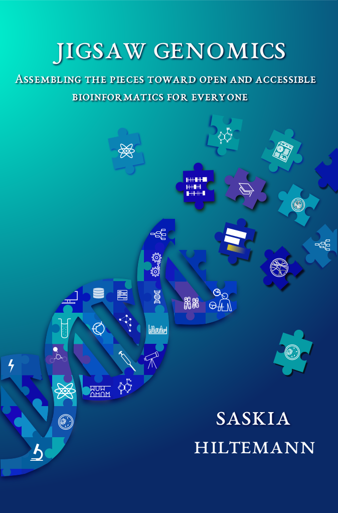

# PhD Thesis

My PhD Thesis created in LaTeX

[Online Flipbook of my PhD Thesis](https://shiltemann.github.io/thesis/)




PhD thesis based on the [dissertate template](https://github.com/suchow/Dissertate)

### Usage

Run `make thesis` to generate the pdf, `make view` to open pdf in okular, and `make watch` to regenerate the pdf on every change.


### Requirements

Ubuntu:

```
sudo apt-get install texlive texlive-xetex latexmk fonts-noto

# optional (needed to be able to use all make commands):
sudo apt-get install inotify-tools okular
```
